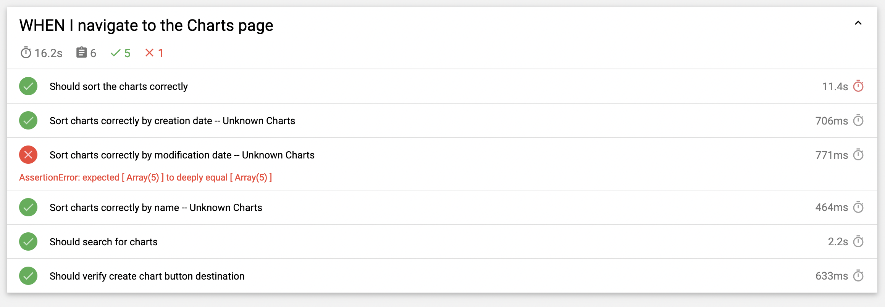
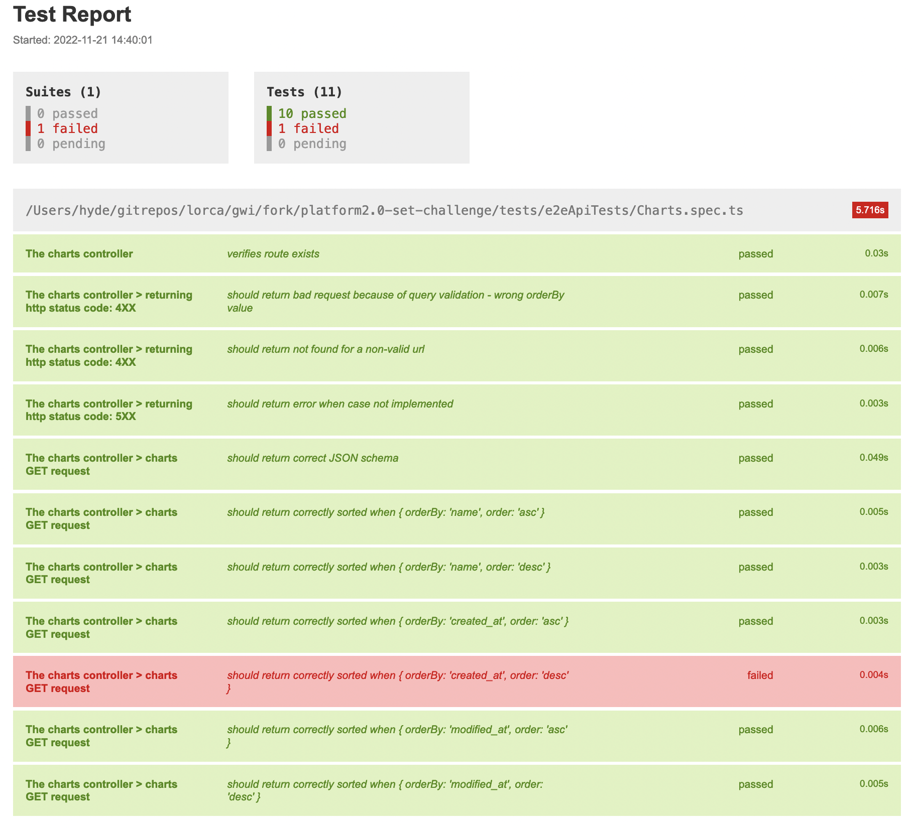
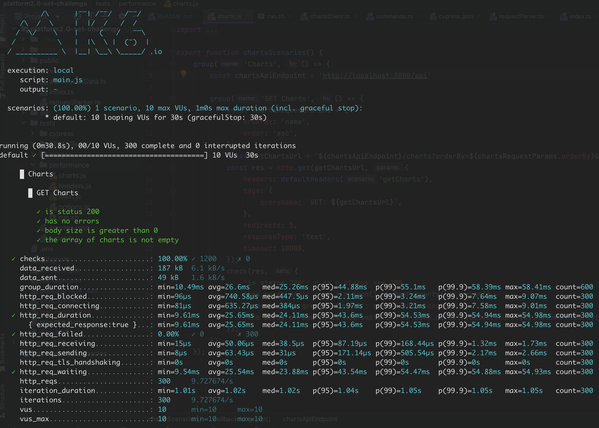

# GWI SET(Software Engineer in Test) Challenge

## Exercise: Charts page testing

### Describe the test scenarios and automate them

In this assigment you need to implement a E2E testing of your taste based on a preexisting micro application. Instructions on how to run the micro application can be found right below.

### `My Charts` Micro application

Charts are a central piece of our platform. `My Charts` is a small app that allows you to view your existing charts. This micro application consists of a

- dummy server with a single endpoint and
- a 3-page web interface where the e2e testing should only take place on the first page

### Setup

In order to be able to run the application locally you have to:

1. Install node version < 16 (due to a bug on [create-react-app](https://stackoverflow.com/questions/69693907/error-err-package-path-not-exported-package-subpath-lib-tokenize-is-not-d))
2. Clone git repository: `git clone https://github.com/GlobalWebIndex/platform2.0-set-challenge.git`
3. Goto dir: `cd platform2.0-set-challenge`
4. Install dependencies: `npm install`
5. Start application: `npm run start`
    - This creates and runs a server on <http://localhost:3001> and also
    - a react application on <http://locahost:3000> which proxies requests to the server above.
6. After that the micro application can be found here: <http://localhost:3000>

We prefer using the cypress e2e framework but any tool of choice would do.

### SET Testing challenge

Please provide E2E & API testing for the `My Charts` app and endpoints.

1. #### Frontend / E2E automation test on the following

    Please provide Functional E2E test suite using your UI automation framework of choice.

    Note that we have omitted a lot of details in this description on what kind of tests should be implemented and how. We hope you will fill these details in and prove to us that you are aware of industry best practices and that you also follow them. In your code, we would like to see your code structure, test design, and test strategy.

2. #### API test

    The below endpoint is responsible for fetching the charts.
    | URL | `http://localhost:3000/api/charts` |
    | --- | --- |
    | Method | GET |

    | Param | Values | Description|
    | --- | --- | --- |
    | orderBy | dateCreated | Order results based on their creation date |
    | orderBy | dateModified | Order results based on their modified date |
    | orderBy | name | Order results based on their name |
    | order | desc / asc | Specify ascending or descending order |


    #### Responses

    | Code | Description |
    | --- | --- |
    | 200 | OK ```[{ name: string, created_at: timestamp, modified_at: timestamp}]``` |
    | 400 | Client Error |
    | 404 | Not Found  |
    | 500 | Server Error |

### Bonus

1. #### Performance Tests
Include a relevant performance test suite for above endpoints using any framework of your choice (though we prefer k6.io)

2. #### CI /CD
Could you provide a workflow that builds and starts application run your existing test suites and informs with the results back to the end user

In case you are not able to implement something you would normally implement for time reasons, make it clear with a comment.
Feel free to ask questions if something is not clear, please give your best shot on this task.

### Submission

Just a make a PR to the current repo! Good luck, potential colleague!

### SET Challenge

### Requirements

- Node.js `>=14`
- npm
- One or more of the supported browsers: **Chrome - Chromium - Firefox** (Tested on v.107)

### How to run?
- Open the terminal and navigate to the root folder of this project
- Install the dependencies with `npm i`
```
$ npm i
```
1. #### Frontend / E2E automation using Cypress:
#### Run the tests using one of the following options:
1) Chrome - Headless
```
$ npm run cypress:run
```
2) Chrome - Headed
```
$ npm run cypress:run:headed
```
3) Chrome with mochawesome report (report can be found at `./mochawesome-report`)
```
$ npm run cypress:run:report
```
4) Chromium - Headless
```
$ npm run cypress:run:chromium
```
4) Firefox - Headless
```
$ npm run cypress:run:firefox
```
5) Open Cypress UI (With Chromium or Chrome, dev tools will open automatically by the plugin provided)
```
$ npm run cypress:open
```

2. #### API/E2E automation using Jest/Supertest:
#### Run the tests using the following command:
```
$ npm run test:api
```
3. #### Performance tests using K6:
#### Run the tests using the included script file from the performance folder:
```
$ ./run.sh
```
### About this project
#### Results
**Cypress:**
There is a bug in the FE application: <br>
The dates displayed in the `Last Modified` column have been replaced with the dates in the `Date Created` column.<br>
The bug can be found in the file `src/components/list/List.tsx`.<br>
Line 117 should be changed to: `{format(new Date(item.modified_at), "d MMM yyyy")}`
### 
**API Tests:**
In the API there is a failure when we request the charts sorted by `DateCreated` in
descending order.
The request seems to fail due to a 'not implemented error'
in the backend. Nevertheless, the received http code is `500` instead of `501`.
### 
**Performance Tests:**
Results with the following options:
```
http_req_duration: ['p(95)<2500', 'med<2000', 'p(99)<4000']
http_req_waiting: ['p(95)<5000']
http_req_failed: ['rate<0.01']
checks: ['rate>0.99']
```
The Nonfunctional Requirements displayed here are arbitrarily chosen as an example.
### 
#### Structure
```
.
├── cypress
│   ├── downloads
│   ├── e2e
│   │   └── Charts.spec.ts
│   ├── pages
│   │   ├── ChartsPage.ts
│   │   └── MasterPage.ts
│   ├── plugins
│   │   └── index.cjs
│   ├── support
│   │   ├── commands.ts
│   │   ├── index.d.ts
│   │   └── index.js
│   └── tsconfig.json
├── cypress.json
│
├── e2eApiTests
│   ├── Charts.spec.ts
│   ├── tsconfig.json
│   └── utils
│       ├── chartsClient.ts
│       ├── config.ts
│       ├── sorted.ts
│       └── toBeSortedBy.ts
│
├── performance
│   ├── charts.js
│   ├── headers.js
│   ├── main.js
│   ├── options.js
│   └── run.sh
└── types.ts
```
#### **Cypress:**
**e2e** is the folder that contains our scenarios <br>
**pages** folder contains element locators in files that correspond to each individual page. The goal is for the locators to be reusable and grouped together for easier maintenance. <br>
**plugins** folder contains the dev tools opener plugin which is used for easier debugging <br>
In the **support** folder, a collection of custom commands and assertions can be found.

#### **e2eApiTests:**
**Charts.spec.ts** is the file that contains our scenarios <br>
**utils** folder, contains a custom jest assertion for easier
verification of the sorted results and a SuperTest client that can be reused in various tests.

#### Moving forward:
**CI/CD:**<br>
An example pipeline:
The following example pipeline could be triggered in every commit <br>
**Note:** The necessary docker/docker-compose files should be added to the project.
The complete steps for the CI and the different pipelines needed may vary from this example since
there are many dependencies. The release procedure, the resources available
and the continuous delivery goals of the product will affect the final design. <br>
**Stages:**
- clone/checkout code
- linter checks
- run BE unit tests
- run FE unit tests
- run application(containerised/isolated)
- wait until services alive
- run api tests dockerized and store results/reports
- run cypress tests dockerized and store results/reports
- trigger deploy
